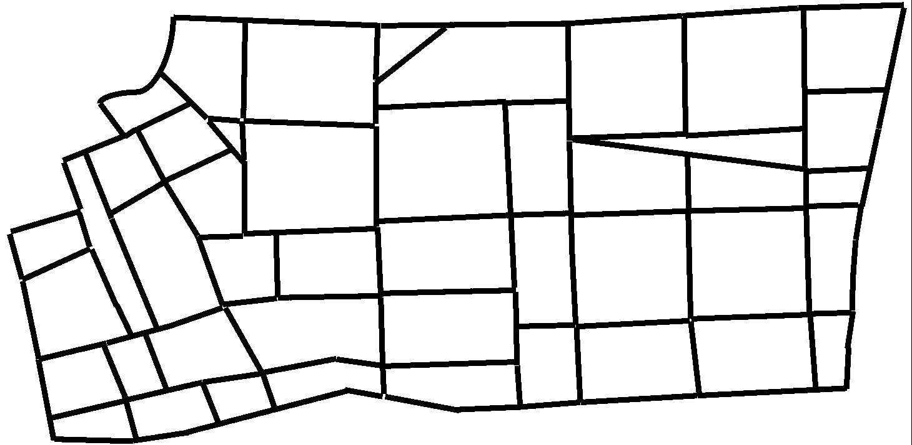
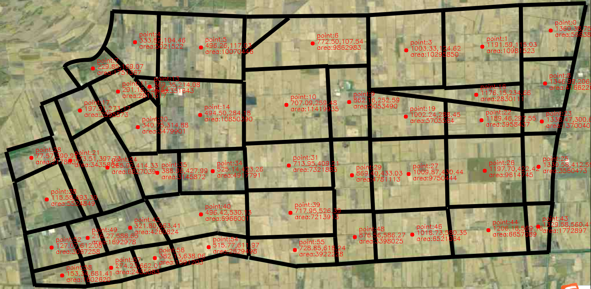

# Domain center and area caculation
## Function
计算图片中划分区域的面积及质心
Calculate the area and center of every domain in one picture
## Example
### Input:

### Intermediate:

### Output:

## Run
先运行gen_bin.py, 需要修改其中的pic路径

`python gen_bin.py`

再利用process_bin.py, 修改其中的bin路径以及ori路径, 分别指向二进制图片和初始图片, 生成相关最终图以及质心点坐标

`python process_bin.py`
